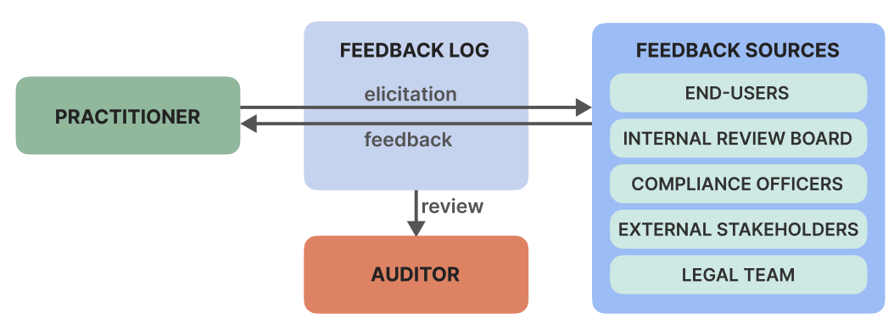

# Feedback Log Tool

This is an openly available tool for creating feedback logs. There are two complementary software tools in this repo:

`website/`

A web interface to view and update feedback logs, designed for use by experts and machine learning practioners. Accessible [here](https://feedback-log.web.app/).

`tool/`

A command line interface (CLI) designed for use by practitioners to track updates to code based on expert feedback.

